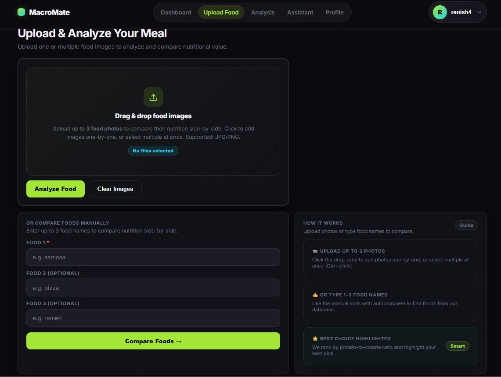
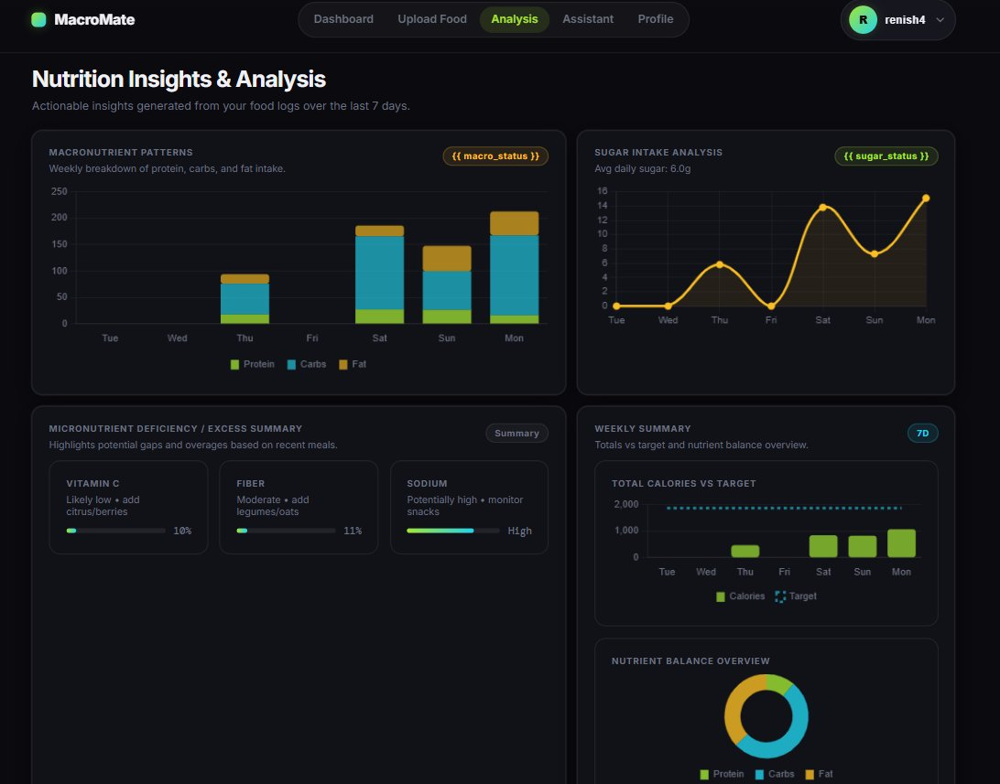

# 🥗 MacroMate — AI-Powered Personalized Nutrition Assistant

> A full-stack Django web application that uses computer vision and machine learning to detect food from images, analyze nutritional content, and help users track their daily calorie and macro intake.

---

## 📋 Table of Contents

- [Overview](#overview)
- [Features](#features)
- [Tech Stack](#tech-stack)
- [Food Detection System](#food-detection-system)
- [Project Structure](#project-structure)
- [Installation & Setup](#installation--setup)
- [Environment Variables](#environment-variables)
- [Running the Project](#running-the-project)
- [Pages & Routes](#pages--routes)
- [Nutrition Data Sources](#nutrition-data-sources)
- [AI Assistant](#ai-assistant)
- [PDF Export](#pdf-export)
- [Authentication](#authentication)
- [Database Models](#database-models)
- [Screenshots](#screenshots)

---

## Overview

MacroMate is a dark-themed, premium nutrition tracking platform. Users can upload food photos or enter food names manually to get instant nutritional data. The app tracks daily calorie intake, macro breakdowns (protein, carbs, fat), and provides weekly analysis with interactive charts.

---

## Features

| Feature | Description |
|---|---|
| 🍕 **Food Image Detection** | Upload 1–3 food photos; AI detects the food and fetches nutrition |
| ⚖️ **Multi-Food Comparison** | Compare up to 3 foods side-by-side with a "Best Choice" recommendation |
| ✍️ **Manual Food Lookup** | Type food names with autocomplete to compare nutrition without images |
| 📊 **Nutrition Dashboard** | Real-time KPIs: calories, protein, carbs, fat, sugar, fiber, vitamins |
| 📈 **Weekly Analysis** | 7-day calorie trend, macro breakdown charts, sugar intake, nutrient balance |
| 🤖 **Food Assistant** | Food-only AI chatbot backed by Spoonacular API for nutrition Q&A |
| 🙍 **User Profile & TDEE** | Calculates daily calorie target using Mifflin–St Jeor + activity multipliers |
| 🗒️ **Meal History** | Logs every saved meal with calories and macros; filterable by date |
| 🏋️ **Exercise Tracking** | Record exercises with calories burned and duration |
| 📄 **PDF Export** | Download today's food log or full history as a formatted PDF |
| 🔐 **Auth** | Email/password and Google OAuth sign-in via django-allauth |
| 🍱 **Portion Calculator** | Natural-language portion parsing ("2 slices", "half bowl") scales nutrition |

---

## Tech Stack

| Layer | Technology |
|---|---|
| **Backend** | Python 3.11+, Django 5.x |
| **ML / CV** | TensorFlow / Keras (EfficientNet), OpenAI CLIP (ViT-B/32) |
| **Frontend** | HTML5, CSS3 (custom design system), Vanilla JS, Chart.js 4 |
| **Database** | SQLite (development) / PostgreSQL (production-ready) |
| **Auth** | django-allauth (email + Google OAuth) |
| **APIs** | Spoonacular Food API |
| **PDF** | ReportLab |
| **Fonts** | Inter, DM Mono (Google Fonts) |

---

## Screenshots

### 📊 Dashboard

> Real-time KPI cards showing daily calorie target, calories consumed, remaining budget, weekly average, macro progress bars (carbs, protein, fat), micronutrient indicators (sugar, fiber, vitamins), and a 7-day calorie trend chart.

---

### 📸 Upload & Analyze Food

> Drag-and-drop upload zone supporting up to 3 food photos for side-by-side comparison. Alternatively, type up to 3 food names in the manual entry slots with live autocomplete powered by the local nutrition database.

---

### 📈 Nutrition Insights & Analysis

> 7-day stacked bar chart for macronutrient patterns, sugar intake trend line, micronutrient deficiency summary (Vitamin C, Fiber, Sodium), calories vs. target bar chart, and a doughnut chart showing the overall nutrient balance.

---

## How It Works

MacroMate's workflow is designed around three core user journeys: **detecting food from a photo**, **looking up food manually**, and **tracking nutrition over time**.

### 🔁 End-to-End Workflow

```
User signs up / logs in
         │
         ▼
  ┌──────────────────────────────────┐
  │         Upload Food Page         │
  │  ┌────────────┐  ┌────────────┐  │
  │  │ Upload 1–3 │  │ Type 1–3  │  │
  │  │  photos    │  │ food names │  │
  │  └─────┬──────┘  └─────┬──────┘  │
  └────────│───────────────│──────────┘
           │               │
           ▼               ▼
    AI Detection      CSV / Fuzzy
    (ML Pipeline)     Name Match
           │               │
           └───────┬───────┘
                   │
                   ▼
         Nutrition Lookup
      (JSON → API → CSV fallback)
                   │
         ┌─────────┴─────────┐
         │  Single food?     │  Multiple foods?
         ▼                   ▼
    result.html        multi_result.html
    (full detail)      (side-by-side +
                        best choice)
                   │
                   ▼
         User enters portion size
         ("2 slices", "half bowl")
                   │
                   ▼
         Portion Parser → scaled
         calories & macros
                   │
                   ▼
         "Save to History" button
                   │
                   ▼
         FoodHistory record saved
         to database for this user
                   │
                   ▼
         Dashboard & Analysis
         update automatically
```

---

### 🍕 Step 1 — Upload or Enter Food

Navigate to **Upload Food**. You have two options:

**Option A — Image Upload**
- Drag and drop or click to select up to **3 food photos** (JPG/PNG)
- Images are accumulated one-by-one; a thumbnail preview is shown for each
- Click **Analyze Food** to submit

**Option B — Manual Entry**
- Type food names into the 3 labelled slots
- Each slot has **live autocomplete** — it queries the local food database as you type
- Use arrow keys to navigate suggestions, Enter to select, Escape to dismiss
- Click **Compare Foods** to submit

---

### 🤖 Step 2 — Food Detection (Image path only)

When photos are submitted, each image passes through the **hybrid ML pipeline**:

| Step | What happens |
|---|---|
| **Preprocess** | Image resized to 224×224, EfficientNet normalization applied |
| **Custom model** | `final_model.h5` runs inference; confidence checked against 55% threshold |
| **CLIP fallback** | If custom model is unavailable or low confidence, CLIP zero-shot runs |
| **Manual confirm** | If both models are uncertain, user is shown a confirmation prompt with autocomplete |

The terminal logs every decision: which model was used, what food was detected, and the confidence score.

---

### 🥗 Step 3 — Nutrition Lookup

Once a food name is known (from detection or manual entry), nutrition is fetched via a tiered lookup:

```
1. nutrition_lookup.json  ←  richest data (fiber, vitamins, calcium, iron)
        │ not found?
        ▼
2. Spoonacular API         ←  live data, used when USE_API_NUTRITION = True
        │ not found?
        ▼
3. calories.csv            ←  local fallback, always available offline
```

---

### ⚖️ Step 4 — Single vs. Multi Result

| Condition | Result page |
|---|---|
| 1 food, confidence ≥ 80% | `result.html` — full nutrition panel, no confirmation needed |
| 1 food, confidence < 80% | `result.html` — confirmation prompt shown |
| 2–3 foods | `multi_result.html` — side-by-side comparison, best choice highlighted in green |

The **best choice** algorithm scores each food by: `(protein / calories × 100) - (calories / 500)` — favouring high protein-to-calorie ratio.

---

### 🍽️ Step 5 — Portion Calculator

On the result page, a built-in chat interface lets you type a natural-language portion:

```
"2 slices"  →  220g  →  scaled calories & macros
"half bowl" →  90g   →  scaled calories & macros
"3 scoops"  →  210g  →  scaled calories & macros
```

The portion parser maps unit keywords (`slice`, `scoop`, `bowl`, `egg`, `g`, `kg`) to grams, multiplied by the quantity. After calculation, the result is displayed in the chat and marked ready to save.

---

### 💾 Step 6 — Save to History

Clicking **Save to History** sends a POST request with food name, calories, and macros. A `FoodHistory` record is created for the logged-in user. The dashboard and meal history page update immediately on next load.

---

### 📊 Step 7 — Dashboard & Analysis

The **Dashboard** aggregates today's `FoodHistory` entries to show:
- Daily calorie target (from user profile TDEE)
- Calories consumed and remaining
- Macro progress bars with percentage of daily target
- Estimated micronutrient indicators (sugar, fiber, vitamins, calcium, iron)
- 7-day calorie trend chart and today's macro bar chart

The **Analysis** page aggregates the last 7 days to show:
- Stacked bar chart: protein, carbs, fat per day
- Sugar intake trend line
- Micronutrient deficiency/excess summary
- Weekly calories vs. target bar chart
- Nutrient balance doughnut chart

---

### 🧮 TDEE Calculation (Profile)

When a user fills in their profile, MacroMate calculates their **Total Daily Energy Expenditure** using the Mifflin–St Jeor formula:

```
Male:   BMR = (10 × weight_kg) + (6.25 × height_cm) − (5 × age) + 5
Female: BMR = (10 × weight_kg) + (6.25 × height_cm) − (5 × age) − 161

TDEE = BMR × activity_factor
  Office (Sedentary): × 1.2
  Moderate:           × 1.55
  Athlete:            × 1.725
```

The result becomes the user's `daily_calorie_goal` displayed throughout the app.

---

### 🤖 AI Assistant Workflow

```
User types a food/nutrition question
              │
              ▼
      Keyword guardrail check
      (is it food-related?)
              │
     ┌────────┴────────┐
   Yes                 No
     │                 │
     ▼                 ▼
  3-tier answer    Polite refusal
  strategy         (off-topic guard)
     │
     ├─ 1. Spoonacular Quick Answer  ← best for factual Qs
     │
     ├─ 2. Local CSV lookup          ← extracts food name, returns structured data
     │
     └─ 3. Spoonacular Chatbot       ← conversational fallback
              │
              ▼
        Reply shown in chat bubble
```

---

## Food Detection System

MacroMate uses a **hybrid, two-tier detection pipeline** to ensure reliable food recognition regardless of what food is uploaded.

### Tier 1 — Custom Trained Model (`final_model.h5`)

The primary detector is a custom-trained **EfficientNet** model fine-tuned on the Food-101 dataset plus additional Indian food categories.

**Foods recognized by the trained model include:**

- All 101 Food-101 classes (pizza, sushi, ramen, hamburger, tacos, etc.)
- Additional Indian foods: samosa, pakoda, bhaji, vada, kachori, dhokla, and more

**How it works:**
- The model preprocesses the uploaded image to 224×224 pixels
- EfficientNet-style normalization (`[-1, 1]` range) is applied
- The model outputs a softmax probability distribution across all classes
- If the **top confidence ≥ 55%**, the result is accepted and nutrition is fetched immediately
- If confidence is below the threshold, the system falls back to Tier 2

```
Confidence ≥ 55%  →  Custom model result accepted  ✅
Confidence < 55%  →  Falls back to CLIP             ⬇
```

> **In short:** If the food is within the model's training set and the image is clear, the custom model handles detection. For foods outside the training set or ambiguous images, CLIP takes over automatically.

---

### Tier 2 — CLIP Pre-trained Model (Fallback)

If the custom model produces low-confidence results **or is unavailable**, MacroMate falls back to **OpenAI's CLIP (ViT-B/32)** zero-shot classifier.

CLIP requires no retraining — it matches the image against a large list of natural-language food descriptions. This means CLIP can recognize foods that were never seen during training.

**CLIP food coverage includes:**
- All custom model foods
- Additional items: dosa, idli, biryani, paneer tikka, butter chicken, sushi variants, dim sum, shawarma, kebab, green curry, pad thai, and dozens more

**How it works:**
- Each food label is converted to a text prompt: `"a photo of {food}"`
- CLIP computes image-text similarity scores
- The top match (if confidence ≥ 30%) is used as the result
- Results below 30% are still shown but flagged for manual confirmation

```
CLIP confidence ≥ 30%  →  Result accepted  ✅
CLIP confidence < 30%  →  User asked to confirm manually  ⚠️
```

---

### Tier 3 — Manual Confirmation Fallback

If both models fail or return very low confidence, the UI presents a confirmation prompt with autocomplete search so the user can manually specify the correct food.

---

### Detection Flow Summary

```
Upload Image
     │
     ▼
Custom Model (final_model.h5)
     │
     ├── Confidence ≥ 55% ──────────────► Return result ✅
     │
     └── Confidence < 55% or model unavailable
          │
          ▼
     CLIP (ViT-B/32) — zero-shot fallback
          │
          ├── Confidence ≥ 30% ──────────► Return result ✅
          │
          └── Confidence < 30%
               │
               ▼
          Show top prediction + ask user to confirm ⚠️
```

All detection decisions and confidence scores are logged to the terminal so developers can monitor model performance in real time.

---

## Project Structure

```
macromate/
│
├── detector/                   # Core Django app
│   ├── views.py                # All page views and API endpoints
│   ├── models.py               # FoodHistory, MealLog, UserProfile, Exercise
│   ├── urls.py                 # URL routing
│   ├── ml_food_predictor.py    # Hybrid ML detector (Custom + CLIP)
│   ├── food_similarity.py      # CSV-based food lookup & related foods
│   └── food_api.py             # Spoonacular ingredient search
│
├── services/                   # Shared service layer
│   ├── nutrition_provider.py   # Tiered nutrition lookup orchestrator
│   ├── api_nutrition.py        # Spoonacular nutrition API
│   ├── csv_nutrition.py        # CSV-based nutrition fallback
│   └── portion_parser.py       # Natural language → grams converter
│
├── templates/                  # Django HTML templates
│   ├── base.html               # Navbar, footer, layout shell
│   ├── dashboard.html          # Main dashboard with KPIs & charts
│   ├── upload.html             # Image upload + manual food entry
│   ├── result.html             # Single food result page
│   ├── multi_result.html       # Multi-food comparison page
│   ├── analysis.html           # Weekly nutrition analysis
│   ├── assistant.html          # AI chat assistant
│   ├── meal_history.html       # Today's food log
│   ├── profile.html            # User profile & TDEE setup
│   └── account/                # Auth pages (login, signup, logout)
│
├── static/
│   ├── css/style.css           # Full custom dark design system
│   └── js/analysis_charts.js  # Chart.js rendering for analysis page
│
├── data/
│   ├── calories.csv            # 105 foods with calorie + macro data
│   ├── calories_macros.csv     # Extended macro dataset
│   └── food101_labels.txt      # Food-101 class labels
│
├── models/                     # ML model files (not committed to git)
│   ├── final_model.h5          # Custom trained EfficientNet model
│   ├── class_indices.json      # Class index → food name mapping
│   └── nutrition_lookup.json   # Rich nutrition data (fiber, vitamins, etc.)
│
├── scripts/
│   └── generate_macros.py      # Utility to compute macros from calorie data
│
├── food_calorie_project/       # Django project settings
│   ├── settings.py             # (gitignored — contains SECRET_KEY, API keys)
│   ├── urls.py
│   ├── wsgi.py
│   └── asgi.py
│
├── manage.py
├── model_diagnostics.py        # Standalone script to test model health
└── .gitignore
```

---

## Installation & Setup

### Prerequisites

- Python 3.10 or 3.11
- pip
- (Optional) CUDA-capable GPU for faster inference

### 1. Clone the repository

```bash
git clone https://github.com/yourusername/macromate.git
cd macromate
```

### 2. Create and activate a virtual environment

```bash
python -m venv venv

# Windows
venv\Scripts\activate

# macOS / Linux
source venv/bin/activate
```

### 3. Install dependencies

```bash
pip install django djangorestframework django-allauth pillow tensorflow \
            torch torchvision reportlab requests python-decouple \
            git+https://github.com/openai/CLIP.git
```

> **Note:** TensorFlow and PyTorch are both used — TF for the custom model, PyTorch for CLIP. Install the CPU versions if you don't have a GPU.

### 4. Place model files

Copy your trained model files into the `models/` directory:

```
models/
├── final_model.h5
├── class_indices.json
└── nutrition_lookup.json     ← optional but recommended for rich nutrition data
```

> If `final_model.h5` is missing, MacroMate will automatically use CLIP as the sole detector. The app will still work fully.

### 5. Apply migrations

```bash
python manage.py migrate
```

### 6. Create a superuser (optional)

```bash
python manage.py createsuperuser
```

---

## Environment Variables

Create a `food_calorie_project/settings.py` (this file is gitignored). Required settings:

```python
SECRET_KEY = 'your-django-secret-key'
DEBUG = True

SPOONACULAR_API_KEY = 'your-spoonacular-api-key'

# Set to True to use Spoonacular for live nutrition data
USE_API_NUTRITION = False

# Google OAuth (via django-allauth)
SOCIALACCOUNT_PROVIDERS = {
    'google': {
        'APP': {
            'client_id': 'your-google-client-id',
            'secret': 'your-google-secret',
        }
    }
}
```

Get a free Spoonacular API key at [spoonacular.com/food-api](https://spoonacular.com/food-api).

---

## Running the Project

```bash
python manage.py runserver
```

Open [http://127.0.0.1:8000](http://127.0.0.1:8000) in your browser.

### Running Model Diagnostics

To verify your model is loaded and working correctly:

```bash
python model_diagnostics.py
```

This will report model architecture, output shape, confidence behavior, and top-5 predictions on a test image.

---

## Pages & Routes

| URL | View | Description |
|---|---|---|
| `/` | `dashboard` | Main nutrition dashboard |
| `/upload/` | `upload_food` | Upload food images or enter manually |
| `/analysis/` | `analysis` | 7-day nutrition charts and insights |
| `/assistant/` | `assistant` | AI food Q&A chatbot |
| `/profile/` | `profile` | User profile and TDEE calculator |
| `/history/` | `meal_history` | Today's food log |
| `/history/download/` | `download_history_pdf` | Full history PDF |
| `/history/today-pdf/` | `download_today_pdf` | Today's log PDF |
| `/manual-food/` | `manual_food_lookup` | Manual food comparison (POST) |
| `/api/food-suggestions/` | `get_food_suggestions_api` | Autocomplete endpoint |
| `/api/confirm-food/` | `confirm_food_and_log` | Confirm detected food |
| `/api/parse-portion/` | `parse_portion_api` | Portion → grams → nutrition |
| `/accounts/login/` | allauth | Login page |
| `/accounts/signup/` | allauth | Sign up page |
| `/admin/` | Django admin | Admin panel |

---

## Nutrition Data Sources

MacroMate uses a three-tier nutrition lookup system:

**Priority 1 — `nutrition_lookup.json`**
Rich per-food data including: calories, protein, carbs, fat, fiber, sugar, vitamin A, vitamin C, calcium, and iron. Populated from training data and Spoonacular.

**Priority 2 — Spoonacular API** *(optional, requires `USE_API_NUTRITION = True`)*
Live lookup for any food by name. Used for portion-scaled nutrition queries (e.g. "2 slices of pizza").

**Priority 3 — `data/calories.csv`**
Local CSV fallback covering 105 foods including international and Indian dishes. Always available offline.

---

## AI Assistant

The MacroMate Assistant (`/assistant/`) is a food-only chatbot with a three-tier answer strategy:

1. **Spoonacular Quick Answer** — for factual nutrition questions ("How many calories in an avocado?")
2. **Local CSV/API Lookup** — extracts the food name from the question and looks it up directly
3. **Spoonacular Chatbot** — conversational fallback using Spoonacular's `/food/converse` endpoint

A keyword guardrail prevents non-food questions from being processed. Off-topic queries receive a polite redirect message instead of being passed to the API.

---

## PDF Export

Two PDF export options are available via ReportLab:

- **Full history PDF** — all meals ever logged, with totals at the bottom
- **Today's log PDF** — styled table with per-meal macros and daily totals, with a branded header bar

---

## Authentication

MacroMate uses **django-allauth** for authentication:

- Email + password registration and login
- Google OAuth sign-in ("Sign in with Google" button)
- All main pages are protected with `@login_required`
- Each user's data is fully isolated by `ForeignKey(User, ...)`

---

## Database Models

### `FoodHistory`
Stores each saved food item per user.

| Field | Type | Notes |
|---|---|---|
| `user` | ForeignKey | Links to Django User |
| `food` | CharField | Food name |
| `calories` | IntegerField | kcal |
| `protein` | FloatField | grams |
| `carbs` | FloatField | grams |
| `fat` | FloatField | grams |
| `image` | CharField | Image URL (optional) |
| `created_at` | DateTimeField | Auto-set on save |

### `UserProfile`
Stores personal nutrition settings and calculated TDEE.

| Field | Type | Notes |
|---|---|---|
| `user` | OneToOneField | |
| `name` | CharField | Display name |
| `height` | PositiveIntegerField | cm |
| `weight` | PositiveIntegerField | kg |
| `age` | PositiveIntegerField | |
| `gender` | CharField | male / female |
| `activity_level` | CharField | office / moderate / athlete |
| `goal` | CharField | loss / maintain / gain |
| `daily_calorie_goal` | IntegerField | Calculated TDEE |

### `Exercise`
Tracks logged workouts.

| Field | Type | Notes |
|---|---|---|
| `user` | ForeignKey | |
| `name` | CharField | e.g. Running, Cycling |
| `calories_burned` | IntegerField | |
| `duration_minutes` | IntegerField | |
| `created_at` | DateTimeField | |

### `MealLog`
Lightweight alternate log model (calories only).

---

## Notes

- Model files (`*.h5`) are excluded from git via `.gitignore` due to file size
- `settings.py` is gitignored — never commit API keys
- CLIP downloads the `ViT-B/32` weights on first run (~350 MB); ensure internet access
- The app gracefully degrades: if the custom model is missing, CLIP is used; if CLIP is missing, the user is always asked to confirm manually

---

## License

MIT License — free to use, modify, and distribute.

---

*Built with ❤️ using Django, TensorFlow, and OpenAI CLIP*
