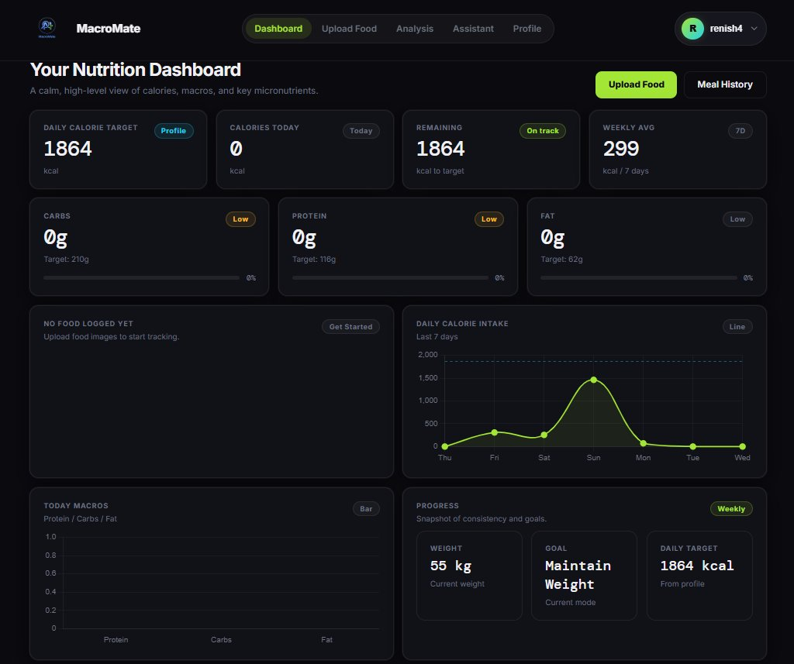
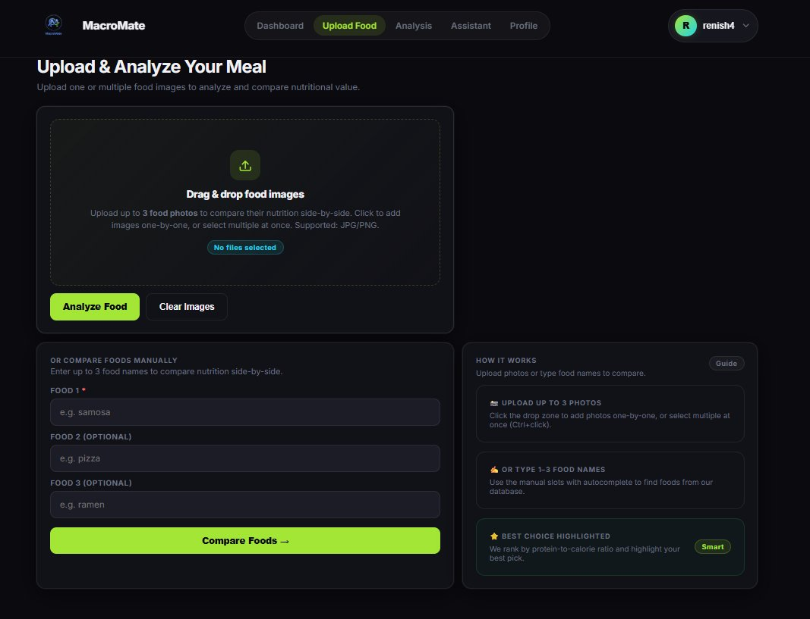
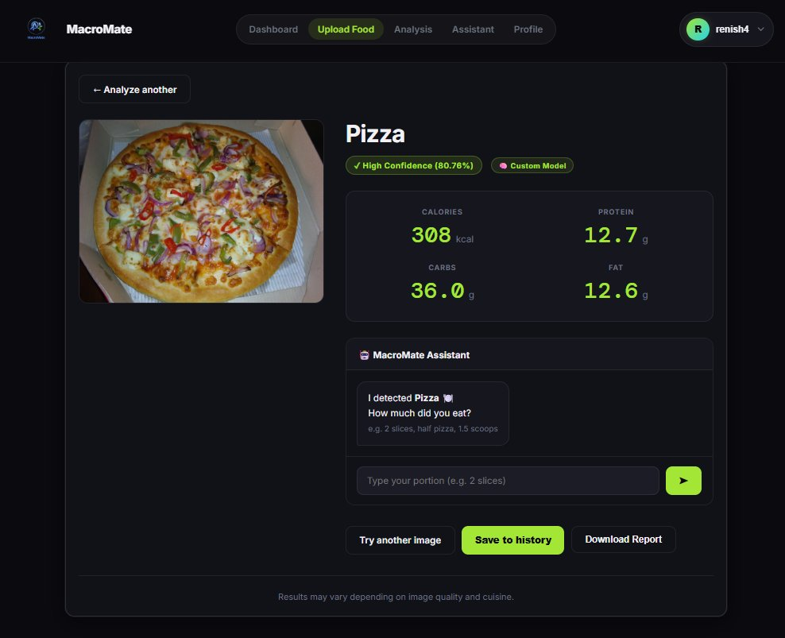
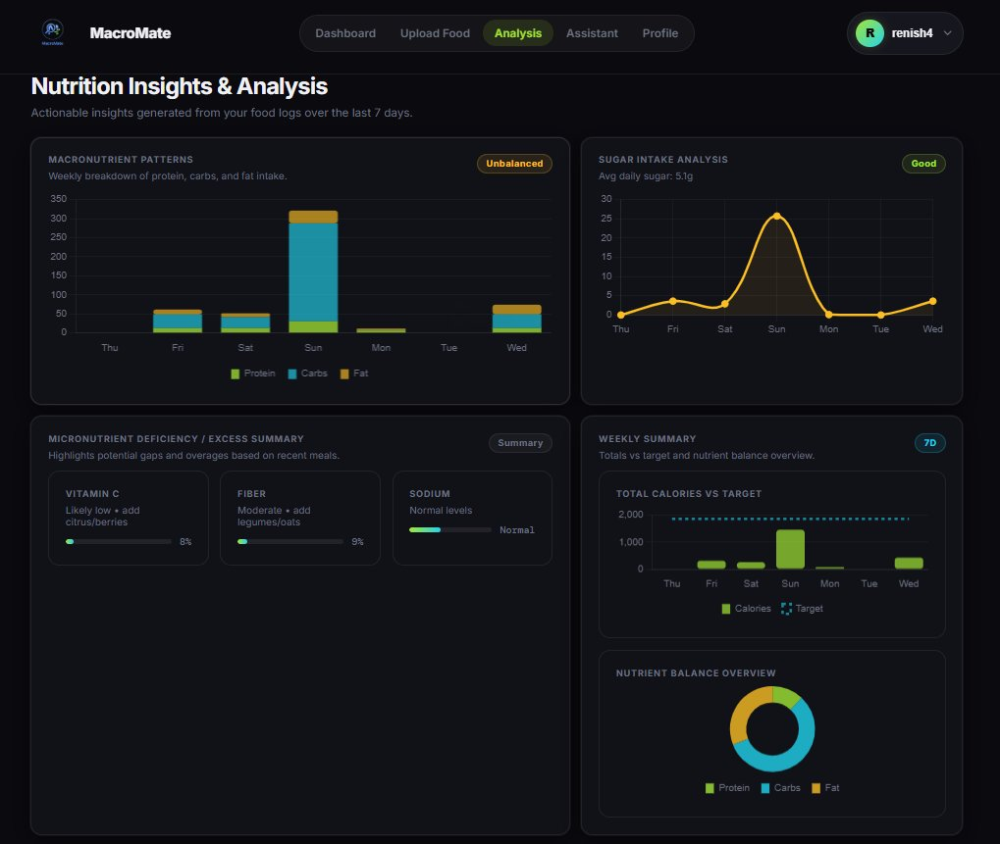
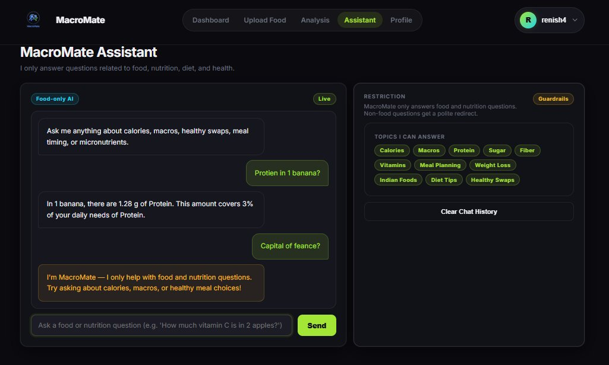
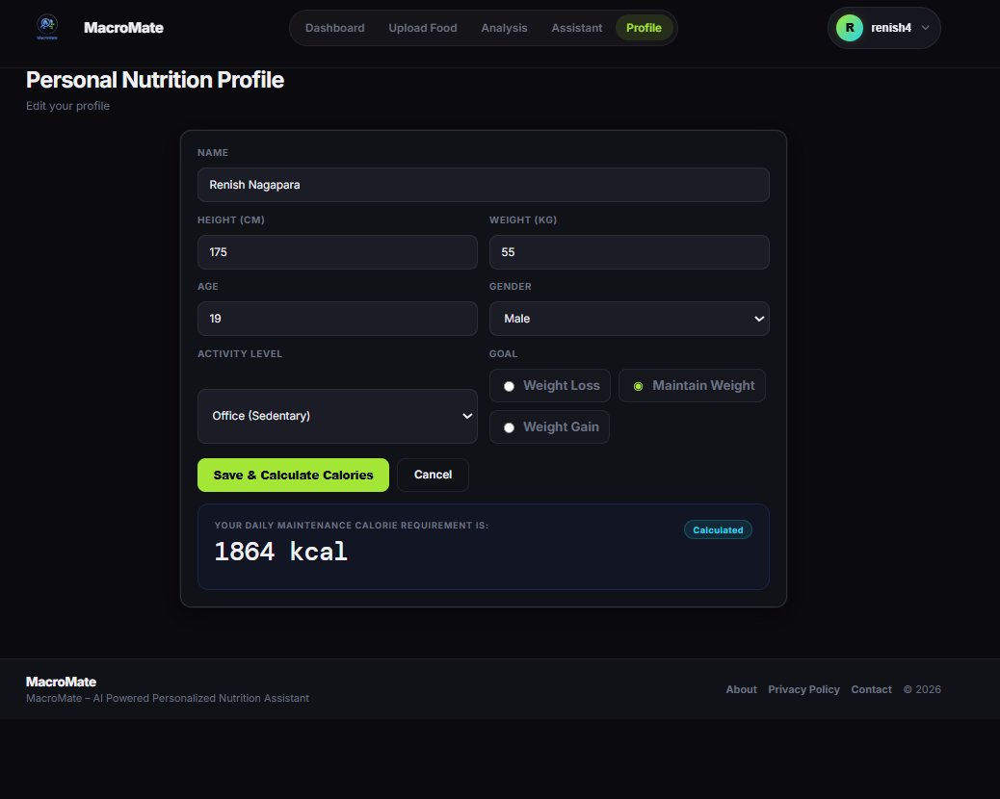
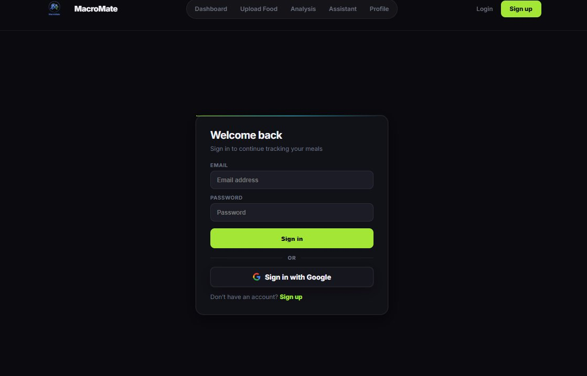

# 🥗 MacroMate — AI-Powered Personalized Nutrition Assistant

<div align="center">


**A full-stack Django web application that uses a custom-trained EfficientNetV2-M deep learning model to detect food from images, analyze nutritional content, and help users intelligently track their daily intake.**

[Features](#-features) · [How It Works](#-how-it-works) · [ML Model](#-ml-model--training) · [Routes](#-pages--routes) · [Database](#-database-models)

</div>

---

## 🌟 Overview

MacroMate is a **dark-themed, premium nutrition intelligence platform** built for real-world use. At its core sits a custom-trained **EfficientNetV2-M** model (54.5M parameters, 351 food classes) trained on over 93,000 images — covering Food-101, Indian foods, and UECFood256. When the custom model is uncertain, OpenAI's **CLIP ViT-B/32** takes over as a zero-shot fallback, ensuring a result is always produced.

Users upload food photos or enter food names to get instant macro and micronutrient data, compare multiple foods side-by-side, track daily intake against a personalized calorie goal (TDEE), and view 7-day trends through interactive Chart.js dashboards.

---

## 📸 Screenshots

<details open>
<summary><strong>🏠 Nutrition Dashboard</strong></summary>
<br>


> Real-time KPIs — calories, macros, micronutrient indicators, 7-day intake chart, and weekly progress snapshot.

</details>

<details>
<summary><strong>📤 Upload & Analyze Food</strong></summary>
<br>


> Drag-and-drop up to 3 food photos or type food names manually for side-by-side nutritional comparison.

</details>

<details>
<summary><strong>🍕 AI Food Detection Result</strong></summary>
<br>


> Instant macro breakdown after detection — with confidence score, model source, and a portion-scaling assistant.

</details>

<details>
<summary><strong>📊 Nutrition Insights & Analysis</strong></summary>
<br>


> 7-day stacked macro chart, sugar trend line, micronutrient deficiency summary, and calories-vs-target overview.

</details>

<details>
<summary><strong>🤖 MacroMate AI Assistant</strong></summary>
<br>


> Food-only AI chatbot with a 60+ keyword guardrail — answers calorie, macro, and diet questions in real time.

</details>

<details>
<summary><strong>👤 Personal Nutrition Profile</strong></summary>
<br>


> Input your stats and instantly calculate your personalized TDEE using the Mifflin–St Jeor equation.

</details>

<details>
<summary><strong>🔐 Authentication</strong></summary>
<br>


> Secure login with email/password or Google OAuth — with forced account picker via django-allauth.

</details>

---

## ✨ Features

| Feature | Description |
|---|---|
| 🍕 **AI Food Detection** | Upload 1–3 photos; custom EfficientNetV2-M (351 classes) detects food with 94%+ confidence on trained foods |
| ⚖️ **Multi-Food Comparison** | Compare up to 3 foods side-by-side with a smart **Best Choice** recommendation based on protein-to-calorie ratio |
| ✍️ **Manual Food Lookup** | Type food names with live autocomplete from the local CSV database — no image needed |
| 📊 **Nutrition Dashboard** | Real-time KPIs: calories, protein, carbs, fat, sugar, fiber, Vitamin A/C, calcium, iron — all from actual meal history |
| 📈 **Weekly Analysis** | 7-day stacked macro bar chart, sugar trend line, nutrient balance doughnut, calories vs. target chart |
| 🤖 **Food-Only AI Assistant** | Chatbot with 60+ keyword guardrail backed by Spoonacular Quick Answer + CSV lookup + Chatbot fallback |
| 🧮 **TDEE Calculator** | Personalized daily calorie target using Mifflin–St Jeor BMR × activity multiplier from user profile |
| 🍽️ **Portion Calculator** | Natural-language input ("2 slices", "half bowl") scales nutrition to the actual amount eaten |
| 🗒️ **Meal History** | Logs every saved meal with IST-aware timestamps, calories, and macros — auto-filtered to today |
| 📄 **PDF Export** | Download today's log or full history as a branded, formatted PDF via ReportLab |
| 🔐 **Authentication** | Email/password + Google OAuth via django-allauth; Google account picker forced on every login |
| 🏋️ **Exercise Tracking** | Log exercises with calories burned and duration |

---

## 🛠 Tech Stack

| Layer | Technology | Purpose |
|---|---|---|
| **Backend** | Python 3.11+, Django 5.x | Web framework, ORM, URL routing |
| **ML — Primary** | PyTorch + torchvision (EfficientNetV2-M) | Custom trained food detection model |
| **ML — Fallback** | OpenAI CLIP (ViT-B/32) | Zero-shot classification for unknown foods |
| **Frontend** | HTML5, CSS3, Vanilla JS | Dark UI design system (CSS variables) |
| **Data Viz** | Chart.js 4 | Dashboard and analysis charts |
| **Database** | SQLite (dev) / PostgreSQL-ready | All user and nutrition data |
| **Auth** | django-allauth | Email + Google OAuth |
| **Nutrition API** | Spoonacular API | Live nutrition lookup + AI assistant |
| **PDF** | ReportLab | Branded food history PDF export |
| **Image Processing** | Pillow (PIL) | Image loading and RGB preprocessing |
| **Fonts** | DM Mono, Inter (Google Fonts) | Display and body typography |
| **Training Hardware** | NVIDIA GeForce RTX 3050 6GB | Mixed-precision GPU training (AMP) |

---

## 🧠 ML Model & Training

MacroMate's food detection system is built around a **custom-trained EfficientNetV2-M** model — not a generic pretrained classifier. Here are the full details.

### Architecture

```
Model:       EfficientNetV2-M (torchvision)
Parameters:  54,529,875 (~54.5M)
Classes:     351 food categories
Input size:  480 × 480 pixels (RGB)
Normalize:   ImageNet mean=[0.485, 0.456, 0.406] std=[0.229, 0.224, 0.225]
Head:        Dropout → Linear(1280, hidden) → ReLU → Dropout → Linear(hidden, 351)
```

### Training Strategy — Two-Phase Approach

| Phase | Epochs | Learning Rate | Trainable Params | Best Val Acc |
|---|---|---|---|---|
| **A — Head Warmup** | 5 | 0.0003 | Classifier only (backbone frozen) | 29.6% |
| **B — Full Fine-Tuning** | 30 | Backbone 1e-05 · Head 0.0001 | All layers | **73.2%** *(epoch 10, still training)* |

**Expected final accuracy: 88–93% top-1 · 96–98% top-5**

### Dataset

| Split | Images |
|---|---|
| Training | 93,661 |
| Validation | 20,103 |
| **Total** | **113,764** |

**Sources:** Food-101 (101 classes) · Indian foods (samosa, biryani, dosa, idli, vada, pakoda, paneer tikka, jalebi, kachori, vadapav, cholebhature, dhokla, pav bhaji…) · UECFood256

### Training Setup

```
Hardware:   NVIDIA GeForce RTX 3050 6GB Laptop GPU (CUDA)
Precision:  Mixed precision via torch.cuda.amp (AMP)
Loss:       CrossEntropyLoss with class weights (handles imbalance)
Scaler:     GradScaler (AMP)
Checkpoint: Saves best_model.pt whenever val accuracy improves
Epoch time: ~30 min/epoch on RTX 3050
```

### Phase B Progress

| Epoch | Train Acc | Val Acc |
|---|---|---|
| 1/30 | 49.8% | 56.8% |
| 3/30 | 72.2% | 66.9% |
| 5/30 | 79.7% | 69.9% |
| 7/30 | 83.5% | 72.5% |
| **10/30** | **85.3%** | **73.2% ← best** |

### Verified Inference Results (standalone script)

```
Pizza     → 94.6% confidence  →  308 kcal · 12.7g protein · 36g carbs · 12.6g fat
Hamburger → 82.2% confidence  →  255 kcal · 12.9g protein · 28.7g carbs · 9.9g fat
```

### Hybrid Detection Pipeline

```
Upload image
      │
      ▼
EfficientNetV2-M (best_model.pt)
  54.5M params │ 351 classes │ 480×480 input
      │
      ├─ confidence ≥ 40%  ──────────────► Custom model WINS
      │                                    Nutrition: label_nutrition_mapping.json
      │
      ├─ 20–40% + food in nutrition DB ──► Custom model WINS
      │                                    (known food, reliable enough)
      │
      └─ confidence < 20%  ──────────────► CLIP ViT-B/32 fallback
                                           Nutrition: Spoonacular API
                                                │
                                                └─ CLIP < 25% ──► Manual confirmation
                                                                   + CSV autocomplete
```

> **Why EfficientNetV2-M?** Its confidence of 82–94% on trained foods comes from softmax over 351 classes — far more meaningful than CLIP's "100%" which is softmax over only ~80 labels.

### Model Files

```
FoodCalorieApp/models/
├── best_model.pt                  ← PyTorch weights (~214 MB) — gitignored
├── class_names.json               ← 351 ordered class names (~7 KB)
└── label_nutrition_mapping.json   ← Nested nutrition data, all 351 classes (~103 KB)
```

---

## 🔁 How It Works

### End-to-End Workflow

```
User signs up / logs in
         │
         ▼
  ┌──────────────────────────────────────┐
  │           Upload Food Page           │
  │  ┌─────────────┐  ┌──────────────┐   │
  │  │ Upload 1–3  │  │  Type 1–3    │   │
  │  │   photos    │  │  food names  │   │
  │  └──────┬──────┘  └──────┬───────┘   │
  └─────────│────────────────│───────────┘
            │                │
            ▼                ▼
   EfficientNetV2-M      CSV Fuzzy Match
   + CLIP fallback       + Autocomplete
            │                │
            └────────┬───────┘
                     │
                     ▼
           Nutrition Lookup
    (JSON → Spoonacular API → CSV)
                     │
          ┌──────────┴──────────┐
      1 food                2–3 foods
          │                    │
          ▼                    ▼
   Single Result         Comparison Table
   + Portion Chat        + Best Choice Badge
          │
          ▼
   Save to History
          │
          ▼
   Dashboard updates KPIs + Charts
```

---

## 📍 Pages & Routes

| URL | View | Description |
|---|---|---|
| `/` | `dashboard` | Main nutrition dashboard with KPIs and charts |
| `/upload/` | `upload_food` | Upload food images or enter manually |
| `/analysis/` | `analysis` | 7-day nutrition charts and insights |
| `/assistant/` | `assistant` | Food-only AI chatbot |
| `/profile/` | `profile` | User profile form and TDEE calculator |
| `/history/` | `meal_history` | Today's food log with totals (IST) |
| `/history/download/` | `download_history_pdf` | Full meal history PDF |
| `/history/today-pdf/` | `download_today_pdf` | Today's formatted PDF |
| `/manual-food/` | `manual_food_lookup` | Manual food comparison (POST) |
| `/reset/` | `reset_analysis` | Clear food session keys (safe logout) |
| `/api/food-suggestions/` | `get_food_suggestions_api` | Autocomplete from CSV |
| `/api/confirm-food/` | `confirm_food_and_log` | Confirm low-confidence detection |
| `/api/parse-portion/` | `parse_portion_api` | Natural language → scaled nutrition |
| `/assistant/chat/` | `assistant_chat` | Chatbot message endpoint |
| `/assistant/clear-history/` | `clear_assistant_history` | Reset chatbot session context |
| `/accounts/login/` | allauth | Login (email or Google) |
| `/accounts/signup/` | allauth | Sign up |
| `/admin/` | Django admin | Backend admin panel |

---

## 🍽️ Nutrition Data Sources

| Priority | Source | Coverage | When Used |
|---|---|---|---|
| **1st** | `label_nutrition_mapping.json` | 351 foods · calories, protein, carbs, fat, fiber, sugar | Always — checked first (offline) |
| **2nd** | Spoonacular API | Any food · full nutrition + portion scaling | Always for CLIP foods; optionally for all when `USE_API_NUTRITION=True` |
| **3rd** | `data/calories.csv` | 105 foods · calories, protein, carbs, fat | Offline fallback — always available |

> **JSON structure note:** Nutrition values are nested under a `"nutrition_data"` key:
> ```json
> "pizza": {
>   "nutrition_data": { "calories": 308.0, "protein": 12.7, "carbohydrates": 36.0, "fat": 12.6 },
>   "aligned": true
> }
> ```

---

## 🤖 AI Assistant

The MacroMate Assistant at `/assistant/` is a **food-only chatbot** protected by a 60+ keyword guardrail. Non-food questions receive a polite redirect — they never reach the API.

**Three-tier answer strategy:**

1. **Spoonacular Quick Answer** — factual nutrition questions (*"How many calories in 100g of rice?"*)
2. **Local CSV + Regex Extraction** — extracts food name from question, returns structured calorie/macro data
3. **Spoonacular Chatbot** — conversational follow-up using `/food/converse` endpoint with session context

Session-based conversation: `spoonacular_context_id` stored in Django session enables follow-up questions. Click **Clear Chat History** to reset.

---

## 📄 PDF Export

Two export options via ReportLab:

- **Full history PDF** (`/history/download/`) — all meals ever logged with running totals
- **Today's log PDF** (`/history/today-pdf/`) — styled table with per-meal macros, daily totals, branded green header bar, generated in IST timezone

---

## 🔐 Authentication

MacroMate uses **django-allauth** for a complete auth system:

- Email + password registration and login
- Google OAuth sign-in with **forced account picker** on every login (via custom `MacroMateSocialAccountAdapter`)
- All main pages protected with `@login_required`
- Every user's data fully isolated via `ForeignKey(User, on_delete=CASCADE)`
- 14-day session persistence (`SESSION_COOKIE_AGE = 60 * 60 * 24 * 14`)

---

## 🗄️ Database Models

### `FoodHistory`
Every food item saved by a user after detection or manual lookup.

| Field | Type | Notes |
|---|---|---|
| `user` | ForeignKey(User) | Links to the authenticated user |
| `food` | CharField(100) | Food name (e.g. "Pizza") |
| `calories` | IntegerField | Total kcal for the saved portion |
| `protein` | FloatField | Grams (default 0) |
| `carbs` | FloatField | Grams (default 0) |
| `fat` | FloatField | Grams (default 0) |
| `image` | CharField(255) | Uploaded image URL (optional) |
| `created_at` | DateTimeField | Auto-set; queried in IST timezone |

### `UserProfile`
Personal body metrics and calculated TDEE.

| Field | Type | Notes |
|---|---|---|
| `user` | OneToOneField | One profile per user |
| `name` | CharField(120) | Display name |
| `height` | PositiveIntegerField | Centimetres |
| `weight` | PositiveIntegerField | Kilograms |
| `age` | PositiveIntegerField | Years |
| `gender` | CharField | `male` / `female` |
| `activity_level` | CharField | `office` / `moderate` / `athlete` |
| `goal` | CharField | `loss` / `maintain` / `gain` |
| `daily_calorie_goal` | IntegerField | Calculated TDEE — drives all dashboard targets |

### `Exercise`
Logged physical activity.

| Field | Type | Notes |
|---|---|---|
| `user` | ForeignKey(User) | Links to user |
| `name` | CharField(100) | e.g. "Running", "Cycling" |
| `calories_burned` | IntegerField | Estimated calories burned |
| `duration_minutes` | IntegerField | Duration in minutes |
| `created_at` | DateTimeField | Auto-set timestamp |

### `MealLog`
Lightweight alternate log model (calories only, for quick tracking).

---

## 🔮 Future Enhancements

- [ ] Complete Phase B training and evaluate final `best_model.pt` (targeting 88–93% top-1)
- [ ] Expand training dataset with more regional Indian, Middle Eastern, and East Asian foods
- [ ] Real-time food detection via device camera (WebRTC live preview)
- [ ] Wearable fitness device integration (Fitbit, Apple Health, Google Fit)
- [ ] Progressive Web App (PWA) with offline support and meal reminder notifications
- [ ] Personalized meal planning based on TDEE and macro targets
- [ ] Barcode scanner for packaged food nutrition lookup
- [ ] Expand AI assistant with a larger LLM for richer conversational coaching
- [ ] Social features — share meals and compare with friends

---

## 📚 References

1. Tan, M., & Le, Q. V. (2021). *EfficientNetV2: Smaller Models and Faster Training.* ICML 2021. [arxiv.org/abs/2104.00298](https://arxiv.org/abs/2104.00298)
2. Radford, A., et al. (2021). *Learning Transferable Visual Models From Natural Language Supervision.* OpenAI CLIP. [arxiv.org/abs/2103.00020](https://arxiv.org/abs/2103.00020)
3. Bossard, L., et al. (2014). *Food-101 — Mining Discriminative Components with Random Forests.* ECCV 2014.
4. Mifflin, M. D., et al. (1990). *A new predictive equation for resting energy expenditure in healthy individuals.* Am J Clin Nutr, 51(2), 241–247.
5. [Spoonacular Food API Documentation](https://spoonacular.com/food-api/docs)
6. [Django Documentation (v5.x)](https://docs.djangoproject.com/)
7. [PyTorch Documentation](https://pytorch.org/docs/stable/index.html)
8. [OpenAI CLIP GitHub](https://github.com/openai/CLIP)

---

## 📜 License

MIT License — free to use, modify, and distribute.

---

<div align="center">

Built with ❤️ using **Django**, **PyTorch EfficientNetV2-M**, and **OpenAI CLIP**

*MacroMate — When AI meets healthy living*

---

### 👨‍💻 Author

**Renish Nagapara**

[](https://github.com/)
[](https://www.linkedin.com/in/renish-nagapara-597814329/)

</div>
